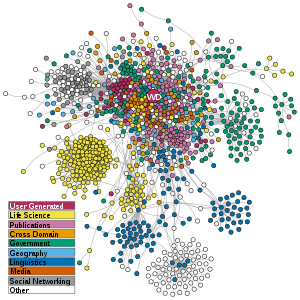

# Semantics-based database for library-ontology & Semantic queries-with-JENA
in this project i created a linked data ontology using OWL for library system , and i made a java project using JENA framework for querying my ontology using Sparql query Language 

     

## Overview
### What does Semantic Data Model mean?

The semantic data model is a method of structuring data in order to represent it in a specific logical way. It is a conceptual data model that includes semantic information that adds a basic meaning to the data and the relationships that lie between them. This approach to data modeling and data organization allows for the easy development of application programs and also for the easy maintenance of data consistency when data is updated.

### Linked Data

Linked data is a method for publishing structured data using vocabularies like schema.org that can be connected together and interpreted by machines. Using linked data, statements encoded in triples can be spread across different websites.

### OWL

The Web Ontology Language is a family of knowledge representation languages for authoring ontologies. Ontologies are a formal way to describe taxonomies and classification networks, essentially defining the structure of knowledge for various domains: the nouns representing classes of objects and the verbs representing relations between the objects.

## Libraries Require
* JENA (jar available with java project)
## Tools Required
* Altova SemanticWorks or any other OWL editor 
* Java IDE 

## Contributing
### Step 1

- **Option 1**
    - 🍴 Fork this repo!

- **Option 2**
    - 👯 Clone this repo 
### Step 2
- **HACK AWAY!** 🔨🔨🔨
 

>if you like this repo give me a star! 🌟

## License

- Copyright 2020 © Raouf Zoghbi.

